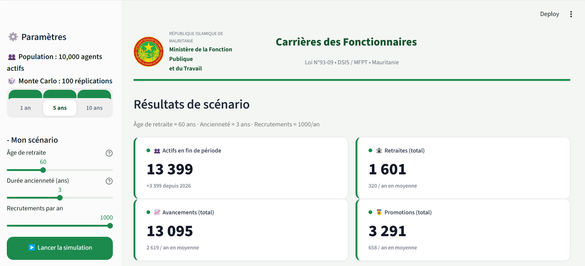

# Mauritania Civil Service Career Simulator

## Description
Une application interactive simulant les carrières de la fonction publique mauritanienne.

## Interface du projet


## Fonctionnalités
- Simulation de carrières d'agents de la fonction publique
- Génération de données d'agents
- Visualisation des résultats

## Technologies utilisées
- Python
- Streamlit

## Lancer l'application
```bash
streamlit run app.py
```
